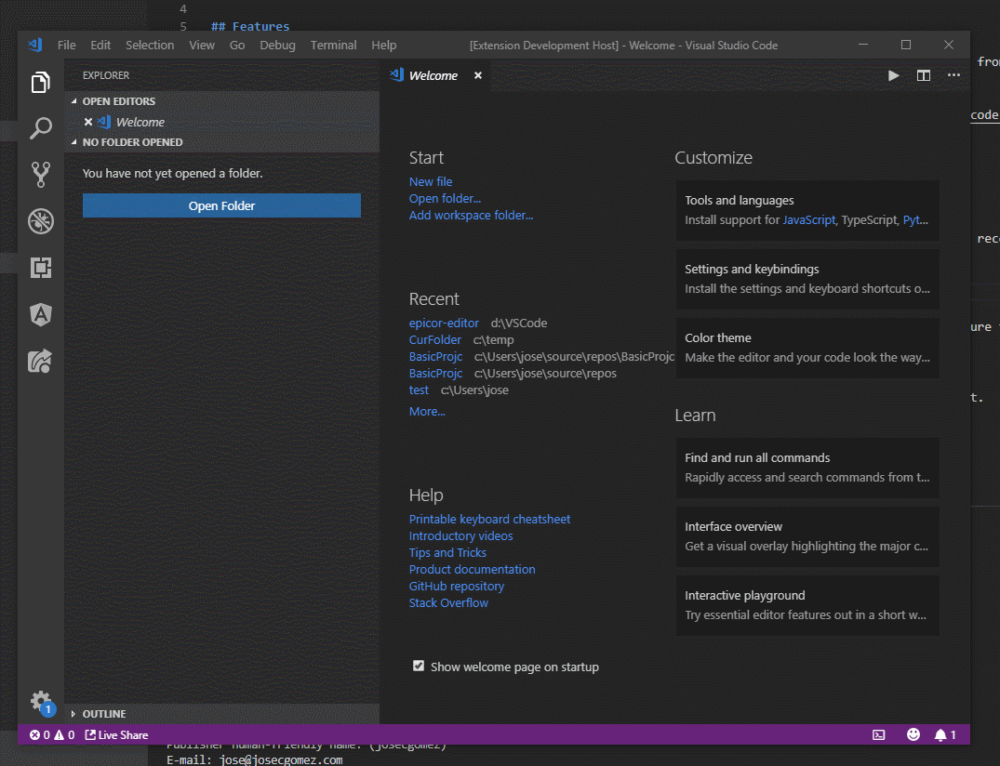
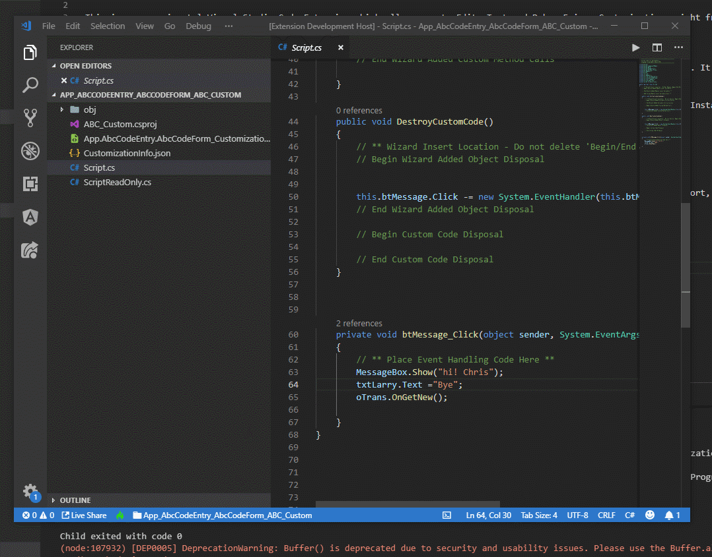
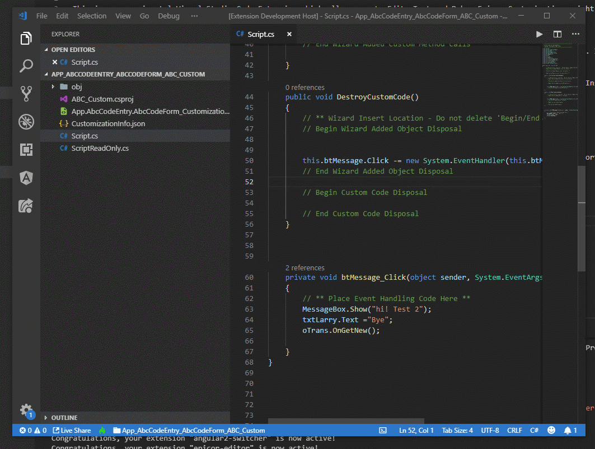

# epicor-editor README

This is an experimental Visual Studio Code Extension which allows you to Edit, Test and Debug Epicor Customizations right from VS Code
# THIS IS HIGHLY EXPERIMENTAL RIGHT NOW USE AT YOUR OWN RISK THIS WILL BE TAKEN DOWN WHEN / IF ITS READY FOR MOST PEOPLE TO USE.

## Features

This is an experimental extension which will allow you to Edit, Test and Debug Epicor Customizations right from VS Code. It can be quite handy specially for the code auto complete feature that VS Code Provides.

I would love some testers, and some feedback, open issues in GitHub. Thanks!

Here is a few animations of the extension in Action

## Requirements

* You will need to have the [OmniSharp Extension] (https://marketplace.visualstudio.com/items?itemName=ms-vscode.csharp) Installed to get this benefit to so install that first.

* If you want to be able to debug using DNSpy you will have to download and install [DNSpy] (https://github.com/0xd4d/dnSpy/releases) and extract it into a folder of your choosing

* Please note you will have to download the helper library from the following links (based on your version of Epicor) and unzip it into your client folder

    [10.2.300.X](https://josecgomez.com/files/CustomizationHelper.10.2.300.X.zip)

    [10.2.200.X](https://josecgomez.com/files/CustomizationHelper.10.2.200.X.zip)

    [10.1.600.X](https://josecgomez.com/files/CustomizationHelper.10.1.600.X.zip)

## Extension Settings

This extension contributes the following settings:

* `epicor.clientfolder`: Should point to the folder where your Epicor client is installed
* `epicor.customizationfolder`: Should point to a folder where you'd like all the customization projects downloaded / created in
* `epicor.dnspylocationr`: The folder in which you installed DNSpy 

## Known Issues

## Release Notes

### 0.0.9

Initial release 

### 0.7.0
Added support for 10.2.200

### 0.14.0
Fixed a bunch of issues, download a new version of the helper lib.
### 0.15.0
* Added support for Dashboard Customizations
* Fixed UD support
* Fixed exported customization format
* Escaped XML conflicting characters
### 0.16.0
* Added support for MES Customization